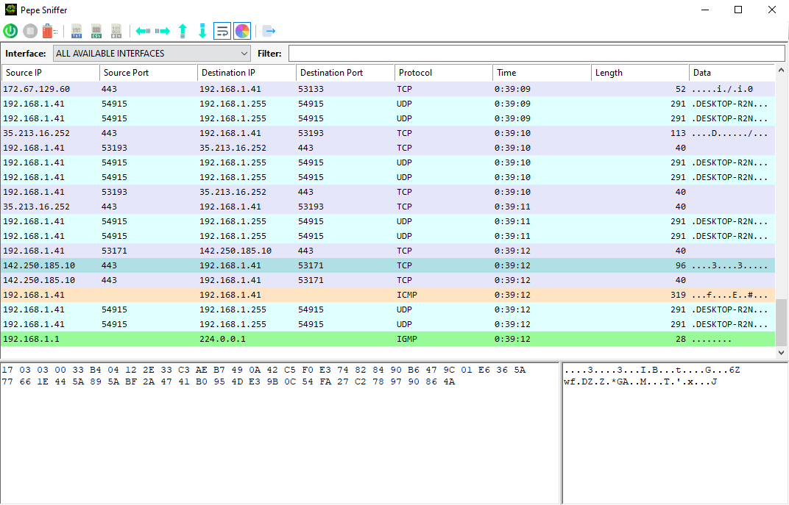
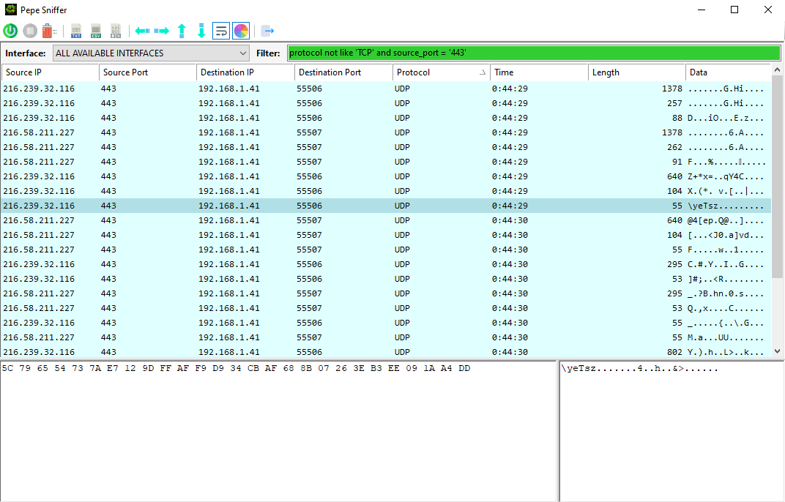

# Packet Analyzer
Packet Analyzer in C# using raw sockets.

## Features
- Captures all the packets in your network
- Allows to choose which interface to listen on
- Advanced filtering
- Export all the packets to text
- Export all the packets to CSV
- Export the selected packet bytes to a binary file
- Packet coloring
- Clean and easy to use interface

To capture all the packets your network card must support promiscuous and monitor modes.

Example showing how to filter packets.

